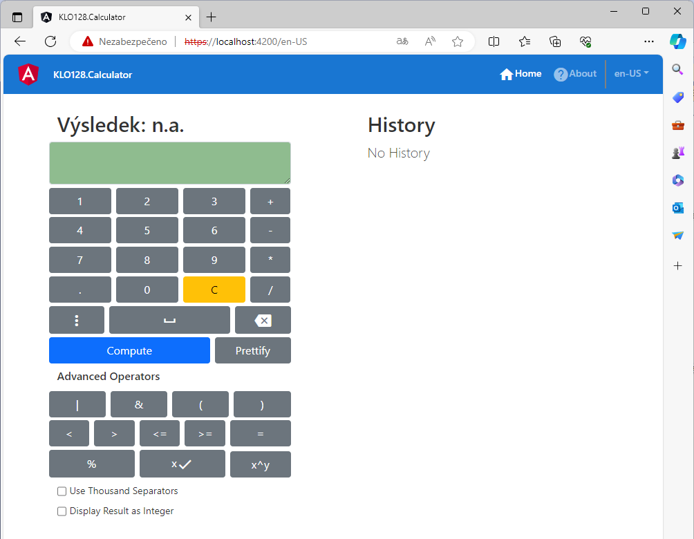
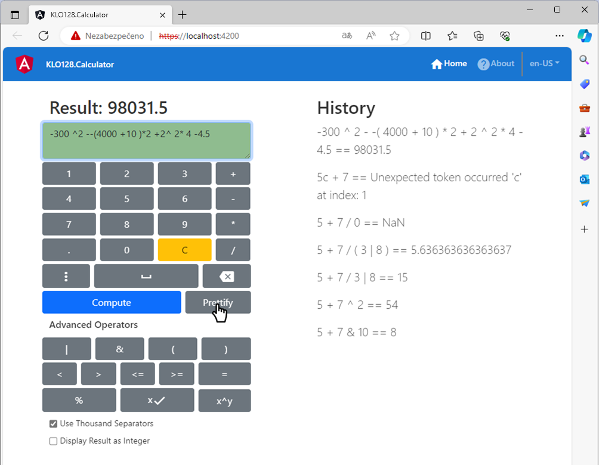
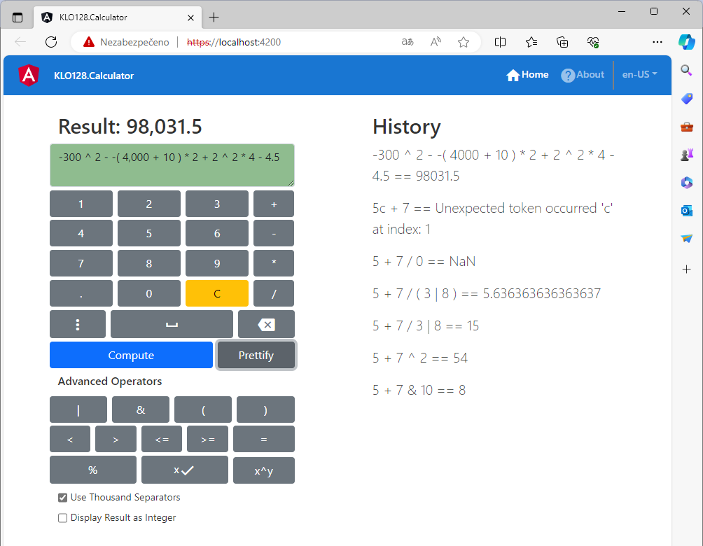
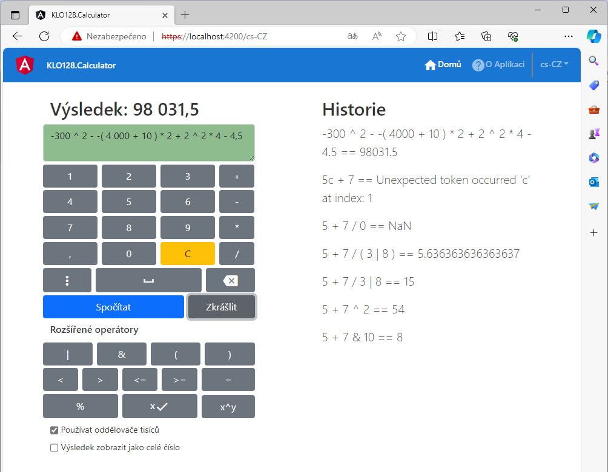
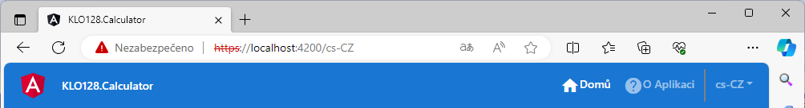

# KLO128.Calculator

## About
This application is able to compute any constant complex binary expression using supported operators and brackets. It can also pretify or normalize the expression and the result as well as it displays a history from cookies.
> This is a training application for learning Angular.

## Quick Start
1. Run the project **KLO128.Calculator.Presentation.Angular** in the Debug configuration.
   - If you have a problem like this: *C:\your-path\package.json (directory description file): SyntaxError: Unexpected token  in JSON*. Just save as **package.json** with a different encoding - UTF8 with BOM is not supported. The current encoding is: Central European - 1250.
1. Allow self signed certificate in a browser.
1. Run the project **KLO128.Calculator.Presentation.WebApi** as a new instance in the Debug configuration!
1. **Enjoy...**
   
   

## Specific Features

### Prettify

> Prettifying does not influence the input expression parsing. Thousand separators can be used even when typing. **But be aware of using the correct ones according to the language selected**.

- **Prettify Using Thousand Separators Before (en-US)**
  
  
- **Prettify Using Thousand Separators After (en-US)**
  
  
- **Prettify Using Thousand Separators After (cs-CZ)**
  
  

### Language
- In order to changing or adding some translations or adding new language translations (i.e.: [KLO128.Calculator.Domain.Shared/](./KLO128.Calculator.Domain.Shared/)*Translations.es-ES.resx*), the file [translations.tt](./KLO128.Calculator.Domain.Shared/translations.tt) has to be run to generate a JSON file to replace [translations.json](./KLO128.Calculator.Presentation.Angular/src/assets/translations.json).
- Language switching is the same redirection as redirection between pages. The page state is persisted.
  
  

### History
- All results including the erroneous ones are stored into the database and retrieved during the application start according to stored browser cookies.
- New results are pushed to the top of the history results as computing of expressions is invoked.

## Author
> KLO128 Solutions

## License
- KLO128.Calculator is licensed under [General Public License v3.0](https://www.gnu.org/licenses/gpl-3.0.html).
- Follow the license terms: [License.md](./License.md)